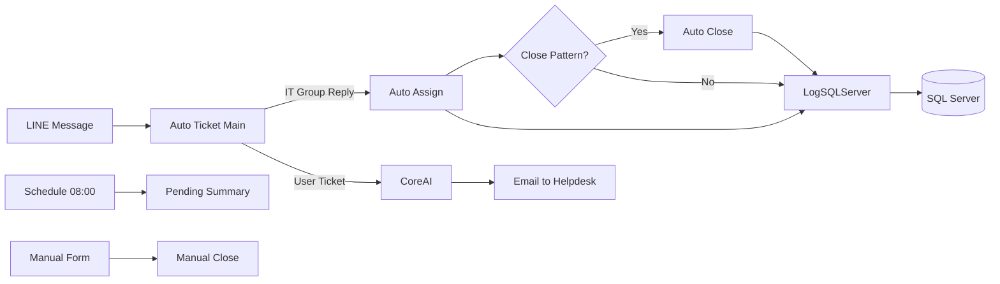

# 🎫 Auto Ticket System - AI-Powered IT Helpdesk Automation

[](https://n8n.io)
[](https://developers.line.biz/)
[](https://openrouter.ai/)
[](https://www.microsoft.com/en-us/sql-server/)
[](LICENSE)

> **Automated IT Helpdesk Ticketing System** with AI-powered classification, auto-assignment, scheduled reminders, and audit logging — built entirely with n8n.


*📸 [View all workflow screenshots →](./screenshots/)*

---

## 📌 Overview

Production-ready IT helpdesk automation built with n8n that handles the entire ticket lifecycle:

**1. Receive** (LINE) → **2. Classify** (AI) → **3. Route** (Email) → **4. Assign** (Auto-reply) → **5. Close** (Resolution) → **6. Remind** (Daily 08:00) → **7. Audit** (SQL Server)

**Impact:** 80% faster ticket creation (5+ mins → 30 secs), zero missed tickets, complete audit trail.

---

## 📊 How It Works in 30 Seconds

```
User posts in LINE:
"สาขา : Central World
ผู้แจ้ง : John
ปัญหา : POS system frozen"

→ AI detects ticket (SW category, Central World branch)
→ Ticket #1234 created in SQL Server
→ Email sent to helpdesk@company.com
→ When IT staff replies → Auto-assigned to them
→ When resolved with "การแก้ไขปัญหา" → Auto-closed
→ All actions logged for audit

IT staff can also manually close tickets via n8n form.
```

---

## 🏗️ System Architecture



*Full architecture: [docs/architecture/system-flow.md](./docs/architecture/system-flow.md)*

---

## ✨ Key Features

| Feature | Tech |
|---------|------|
| 🤖 AI Classification | OpenRouter LLM (HW/SW/Network/Printer) |
| 📱 LINE Integration | LINE Messaging API (real-time) |
| 👤 Auto-Assignment | Quote reply detection |
| 🔒 Auto-Close | Pattern detection (การแก้ไขปัญหา) |
| ✋ Manual Close | n8n form for manual ticket closure |
| ⏰ Daily Reminders | Scheduled 08:00 pending summary |
| 📊 Full Audit Trail | Microsoft SQL Server logging |
| 🔄 Unsend Handling | Message retraction detection |
| 📸 Media Support | FTP upload + hyperlinks |
| 🚨 Error Notify | Telegram alerts for workflow errors |

---

## 🛠️ Tech Stack

n8n | LINE API | OpenRouter | SQL Server | FTP | SMTP (DavMail)

---

## 🚀 Quick Start

**Prerequisites:** n8n v1.0+, LINE API, SQL Server, OpenRouter key, SMTP server

```bash
# 1. Clone
git clone https://github.com/Piyabordee/n8n-auto-ticket-system.git
cd n8n-auto-ticket-system

# 2. Import workflows via n8n UI (Settings → Import):
#    Auto Ticket.json (main) + 5 sub-workflows
#    See [docs/features/](./docs/features/) for workflow details

# 3. Create n8n credentials:
#    LINE API, OpenRouter, SQL Server, SMTP, FTP
#    See [docs/integrations/](./docs/integrations/) for setup

# 4. Run create_tables.sql to set up database
#    → See [create_tables.sql](./create_tables.sql)

# 5. Create Data Tables in n8n:
#    IT_Team, Category, Branch Company, Branch Franchise, Sub Category
#    → See [docs/reference/modification-guide.md](./docs/reference/modification-guide.md)

# 6. Activate all workflows
```

---

## 📁 Project Structure

```
workflows/          # 6 n8n workflow JSON files
screenshots/        # Workflow diagrams
docs/               # Full documentation (features, architecture, integrations, reference)
sanitize.py         # Data sanitizer tool
create_tables.sql    # Database schema
```

---

## ⚙️ Configuration

**Ticket Pattern:** `(สาขา OR แผนก) AND ปัญหา`

**Example:**
```
สาขา : Central World
ผู้แจ้ง : John
ปัญหา : POS system frozen
```

**Environment Variables:**
```env
LINE_CHANNEL_ACCESS_TOKEN=xxx
OPENROUTER_API_KEY=xxx
SQL_SERVER=xxx
SQL_DATABASE=YourDatabase
```

---

## 📝 Documentation

| Topic | Location |
|-------|-----------|
| Workflow Details | [docs/features/](./docs/features/) |
| Architecture Diagrams | [docs/architecture/](./docs/architecture/) |
| Integration Guides | [docs/integrations/](./docs/integrations/) |
| Expression Reference | [docs/reference/expressions.md](./docs/reference/expressions.md) |
| Sanitization Guide | [docs/reference/sanitization.md](./docs/reference/sanitization.md) |

---

## 🤖 Claude Code Skills

| Skill | Purpose |
|-------|---------|
| `/github-sanitize` | Sanitize workflows & docs before push |
| `/doc-version-sync` | Sync version numbers after changes |

---

## 📋 Latest Changes

**v1.7.6 (2026-05-24)**
- Added Manual Close Ticket workflow — close assigned tickets via n8n form
- Improved Error Notify Telegram — escape HTML entities, enhanced error handling

**v1.7.5 (2026-05-06)**
- Added `#type` field (Incident/Service Request)
- Split date/time fields for ticket creation/closure
- Enhanced LogSQLServer with binary mode

*Full changelog: [CHANGELOG.md](./CHANGELOG.md)*

---

## 👤 Author

**Piyabordee Phongam** — IT Automation Engineer

GitHub: [@piyabordee](https://github.com/piyabordee) | LinkedIn: [Piyabordee Phongam](https://linkedin.com/in/piyabordee)

---

## 📄 License

MIT License — see [LICENSE](LICENSE)

---

🙏 Acknowledgments: [n8n](https://n8n.io), [LINE Developers](https://developers.line.biz/), [OpenRouter](https://openrouter.ai/), [Microsoft SQL Server](https://www.microsoft.com/en-us/sql-server/)

---

Made with ❤️ and n8n
