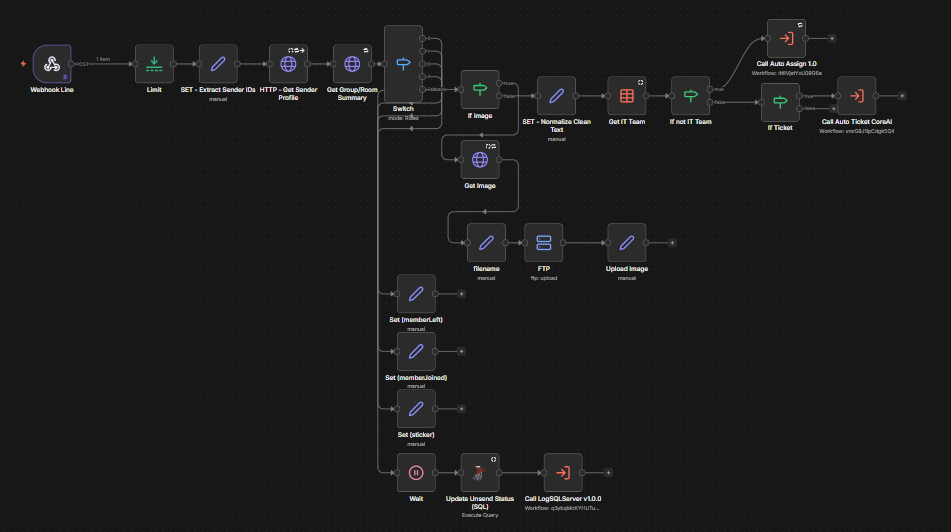
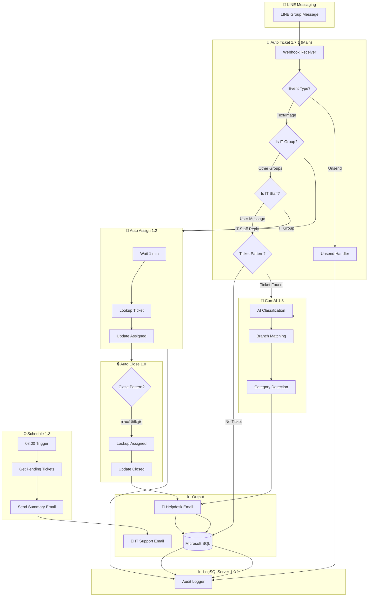
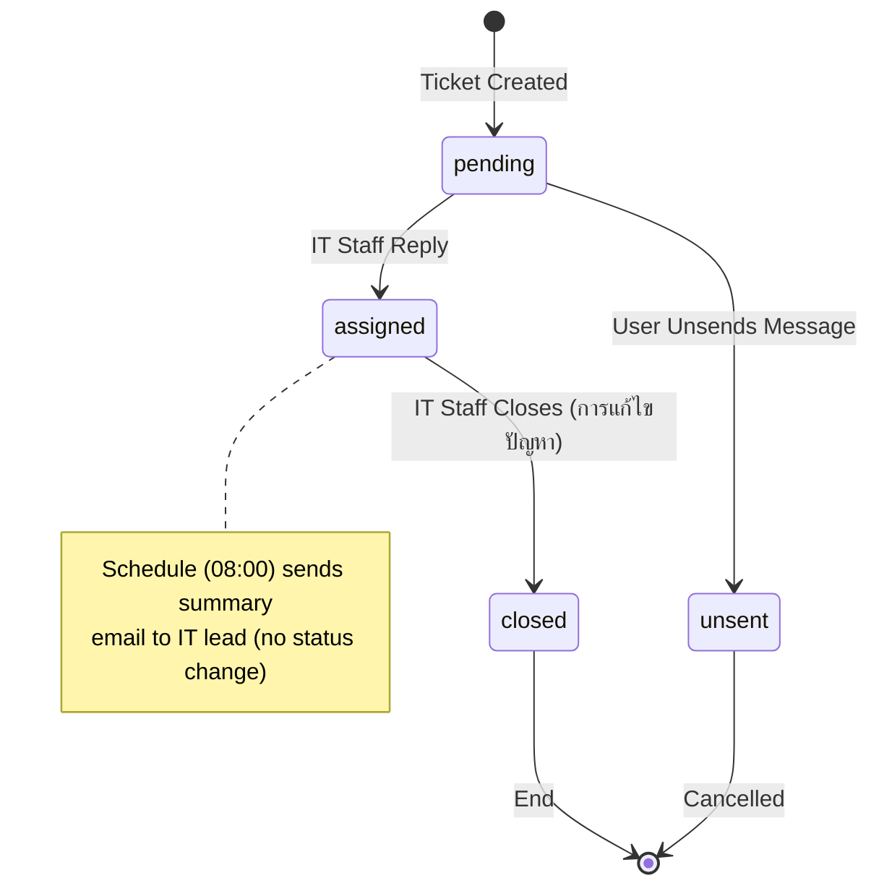

# 🎫 Auto Ticket System - AI-Powered IT Helpdesk Automation

[](https://n8n.io)
[](https://developers.line.biz/)
[](https://openrouter.ai/)
[](https://www.microsoft.com/en-us/sql-server/)
[](LICENSE)

> **Automated IT Helpdesk Ticketing System** with AI-powered classification, auto-assignment via LINE reply, scheduled reminders, and complete audit logging — built entirely with n8n low-code automation.



*📸 View all workflow screenshots at [SCREENSHOTS.md](./SCREENSHOTS.md)*

---

## 📌 Overview

This project demonstrates a **production-ready IT helpdesk automation system** that I designed and implemented using n8n. The system handles the entire ticket lifecycle automatically:

1. 📱 **Receive** - Captures IT support requests from LINE group messages
2. 🤖 **Classify** - Uses AI (LLM) to categorize tickets by type, branch, and priority
3. 📧 **Route** - Sends tickets to helpdesk system via email
4. 👤 **Assign** - Auto-assigns tickets when IT staff replies to messages
5. 🔒 **Close** - Auto-closes tickets when IT staff includes resolution details
6. ⏰ **Remind** - Sends pending ticket summary email to IT lead at 08:00 daily
7. 📊 **Audit** - Logs all ticket operations to SQL Server for traceability

### 🎯 Business Impact
- **80% faster** ticket creation (from manual 5+ mins to automatic 30 secs)
- **Zero missed tickets** with scheduled reminder system
- **Improved accountability** with auto-assignment tracking
- **Complete audit trail** with centralized logging to SQL Server

---

## 🏗️ System Architecture



---

## ✨ Key Features

| Feature | Description | Technology |
|---------|-------------|------------|
| 🤖 **AI Classification** | Automatically categorizes tickets into HW/SW/Network/Printer etc. | OpenRouter LLM (deepseek/deepseek-chat-v3.1) |
| 📱 **LINE Integration** | Receives messages from LINE groups in real-time | LINE Messaging API |
| 🏢 **Branch Detection** | Identifies 100+ branches from natural language | AI + Data Table Matching |
| 👤 **Auto-Assignment** | Assigns tickets when IT staff replies to messages | Quote Reply Detection |
| 🔒 **Auto-Close** | Closes tickets when IT staff includes resolution details | Pattern Detection (การแก้ไขปัญหา) |
| ⏰ **Scheduled Reminders** | Sends pending ticket summary to IT lead at 08:00 daily | n8n Schedule Trigger |
| 🔄 **Unsend Handling** | Detects when users unsend messages and marks tickets accordingly | Event Detection + SQL Update |
| 📸 **Media Support** | Handles images/videos with FTP upload and hyperlinks | FTP + Image Upload |
| 📊 **Full Logging** | Logs all activities to Microsoft SQL Server for analytics | Microsoft SQL Server |
| 🗂️ **Audit Trail** | Tracks all database changes with LogSQLServer sub-workflow | Audit Logging |

---

## 📁 Project Structure

```
📦 n8n-auto-ticket-system/
├── 📄 README.md                           # This file
├── 📄 SCREENSHOTS.md                      # Workflow screenshots & diagrams
├── 📄 AGENTS.md                           # Workflow context documentation
├── 📄 LICENSE                             # MIT License
├── 🐍 sanitize.py                         # Data sanitizer tool
├── 📝 .env.sanitizer.example              # Sanitizer configuration template
│
├── 📁 workflows/                          # n8n workflow JSON files
│   ├── Auto Ticket.json                  # Main workflow (v1.7.1)
│   ├── Auto Ticket CoreAI.json           # AI classification sub-workflow (v1.3)
│   ├── Auto Assign.json                  # Auto-assignment sub-workflow (v1.2)
│   ├── Auto Close Ticket.json            # Auto-close sub-workflow (v1.0)
│   ├── Schedule Ticket Unclose.json      # Scheduled summary workflow (v1.3)
│   └── LogSQLServer.json                 # Audit logging sub-workflow (v1.0.1)
│
└── 📁 screenshots/                        # Workflow screenshots
    ├── main-workflow.png
    ├── ai-classification.png
    ├── auto-assign.png
    ├── schedule.png
    ├── log-sql-server.png
    ├── architecture.png
    └── architecture.mermaid               # Architecture diagram source
```

---

## 🔧 Workflows Overview

### 1️⃣ Auto Ticket 1.7.1 (Main Workflow)
The main orchestrator that receives LINE webhooks and routes messages to appropriate handlers.

| Responsibility | Details |
|---------------|---------|
| Webhook handling | Receives POST from LINE Messaging API |
| Event routing | Handles text, image, video, sticker, unsend, member events |
| IT group detection | Routes IT group messages directly to Auto Assign |
| IT staff detection | Checks if sender is IT team member |
| Ticket detection | Regex pattern matching for ticket format |
| Sub-workflow calls | Routes to CoreAI, Auto Assign, or LogSQLServer |

📎 **Workflow:** [`workflows/Auto Ticket.json`](./workflows/Auto%20Ticket.json)

---

### 2️⃣ Auto Ticket CoreAI 1.3.2 (AI Classification)
AI-powered ticket classification using Large Language Models.

| AI Task | Model | Output |
|---------|-------|--------|
| Core Classification | deepseek/deepseek-chat-v3.1 | Category, Intent (INC/SR), Summary |
| Branch Matching | deepseek/deepseek-chat-v3.1 | Branch name, Company |
| Sub-Category | deepseek/deepseek-chat-v3.1 | Specific sub-category |

**Sample AI Output:**
```json
{
  "category": "SW",
  "intent": "INC",
  "branch_name": "Central World",
  "subject_summary": "POS system frozen during transaction"
}
```

📎 **Workflow:** [`workflows/Auto Ticket CoreAI.json`](./workflows/Auto%20Ticket%20CoreAI.json)

---

### 3️⃣ Auto Assign 1.2 (Auto-Assignment)
Automatically assigns tickets when IT staff reply to the original message.

```
User posts ticket → IT staff replies (quote) → System detects reply
                                                      ↓
                            Wait 1 minute (prevent race condition)
                                                      ↓
                            Lookup pending ticket by quotedMessageId
                                                      ↓
                            Send email with #assign command
                                                      ↓
                            Update ticket status to "assigned"
                                                      ↓
                            Call LogSQLServer for audit logging
```

📎 **Workflow:** [`workflows/Auto Assign.json`](./workflows/Auto%20Assign.json)

---

### 4️⃣ Auto Close Ticket 1.2.1 (Auto-Close)
Automatically closes tickets when IT staff replies with resolution details.

```
IT staff replies (quote) → System detects "การแก้ไขปัญหา" pattern
                                                      ↓
                            Lookup assigned ticket by quotedMessageId
                                                      ↓
                            Extract close_cause and close_reason
                                                      ↓
                            Send email with #close command
                                                      ↓
                            Update ticket status to "closed"
                                                      ↓
                            Call LogSQLServer for audit logging
```

📎 **Workflow:** [`workflows/Auto Close Ticket.json`](./workflows/Auto%20Close%20Ticket.json)

---

### 5️⃣ Schedule Ticket Unclose 1.3 (Scheduled Summary)
Sends a summary email of pending tickets to IT lead for follow-up.

| Schedule | Action |
|----------|--------|
| 08:00 (morning) | Send pending ticket summary to IT_Support@example.com |

**Summary includes:**
- Total count of pending tickets
- Each ticket's: subject, branch, reporter, assigned IT staff, created date, problem detail

📎 **Workflow:** [`workflows/Schedule Ticket Unclose.json`](./workflows/Schedule%20Ticket%20Unclose.json)

---

### 6️⃣ LogSQLServer 1.0.1 (Audit Logging)
Centralized audit logging for all ticket operations across all workflows.

| Action Type | Description | Calling Workflows |
|-------------|-------------|-------------------|
| INSERT | New ticket created | Auto Ticket CoreAI 1.3.2 |
| UPDATE | Ticket assigned | Auto Assign 1.2 |
| CLOSE | Ticket closed | Auto Close Ticket 1.2.1 |
| UNSEND | Message unsent by user | Auto Ticket 1.7.1 |

📎 **Workflow:** [`workflows/LogSQLServer.json`](./workflows/LogSQLServer.json)

---

## 📊 Ticket Status Flow



---

## 🛠️ Tech Stack

| Layer | Technology | Purpose |
|-------|------------|---------|
| **Automation** | n8n | Workflow orchestration |
| **Messaging** | LINE Messaging API | Receive group messages |
| **AI/LLM** | OpenRouter (deepseek/deepseek-chat-v3.1) | Text classification |
| **Database** | Microsoft SQL Server | Ticket storage & audit logging |
| **File Storage** | FTP Server | Image/video uploads |
| **Email** | SMTP (DavMail) | Send to helpdesk system |
| **Hosting** | Self-hosted n8n | Production environment |

---

## 📋 Prerequisites

Before importing these workflows, ensure you have:

- [ ] **n8n** (v1.0+) - Self-hosted or n8n Cloud
- [ ] **LINE Messaging API** - Channel access token
- [ ] **Microsoft SQL Server** - Database server with YourDatabase
- [ ] **OpenRouter** - API key for AI models
- [ ] **SMTP Server** - For sending emails
- [ ] **FTP Server** - For media file uploads (optional)

---

## 🚀 Installation

### Step 1: Clone Repository
```bash
git clone https://github.com/YOUR_USERNAME/n8n-auto-ticket-system.git
cd n8n-auto-ticket-system
```

### Step 2: Import Workflows
```bash
# Using n8n CLI
n8n import:workflow --input=workflows/Auto\ Ticket.json
n8n import:workflow --input=workflows/Auto\ Ticket\ CoreAI.json
n8n import:workflow --input=workflows/Auto\ Assign.json
n8n import:workflow --input=workflows/Auto\ Close\ Ticket.json
n8n import:workflow --input=workflows/Schedule\ Ticket\ Unclose.json
n8n import:workflow --input=workflows/LogSQLServer.json
```

Or import manually via n8n UI: **Settings → Import from File**

### Step 3: Configure Credentials
Create the following credentials in n8n:

| Credential Type | Name | Required For |
|----------------|------|--------------|
| HTTP Header Auth | LINE Messaging API | Webhook receiver |
| HTTP Header Auth | OpenRouter API | AI classification |
| Microsoft SQL | SQL Server | Ticket storage & logging |
| SMTP | DavMail SMTP | Email sending |
| FTP | FTP Server | Media uploads |

### Step 4: Create Database Tables
Create the ticket and log tables in Microsoft SQL Server:

**Ticket Table:**
```sql
CREATE TABLE [YourDatabase].[dbo].[ticket] (
    message_id VARCHAR(50) PRIMARY KEY,
    status VARCHAR(20),
    assigned_to VARCHAR(100),
    assigned_date DATETIME,
    intent VARCHAR(10),
    category VARCHAR(50),
    branch_name VARCHAR(100),
    branch_company VARCHAR(50),
    subject VARCHAR(200),
    clean_text NVARCHAR(MAX),
    raw_text NVARCHAR(MAX),
    email_body NVARCHAR(MAX),
    chatname VARCHAR(100),
    fromuser VARCHAR(100),
    userid VARCHAR(50),
    groupid VARCHAR(50),
    created_date DATETIME,
    created_by VARCHAR(50),
    updated_date DATETIME,
    updated_by VARCHAR(50),
    sub_category VARCHAR(100),
    close_cause NVARCHAR(MAX),
    close_reason NVARCHAR(MAX),
    close_time_minute INT
);
```

**Log Table:**
```sql
CREATE TABLE [YourDatabase].[dbo].[log] (
    table_name VARCHAR(100),
    table_row_id VARCHAR(50),
    action_type VARCHAR(20),
    value NVARCHAR(MAX),
    created_date DATETIME,
    created_by VARCHAR(100),
    message_id VARCHAR(50)
);
```

### Step 5: Create Data Tables
Create these n8n Data Tables:

| Table Name | Purpose |
|------------|---------|
| `IT_Team` | List of IT staff (userId, name, email, active) |
| `Category` | Ticket categories (name, alias) |
| `Branch Company` | Company company branches |
| `Branch Franchise` | Franchise branches |
| `Sub Category` | Sub-category mappings |

### Step 6: Activate Workflows
1. Open each workflow in n8n
2. Update SQL Server connection strings and webhook URLs
3. Toggle **Active** to enable

---

## ⚙️ Configuration

### Environment Variables (Optional)
```env
# LINE
LINE_CHANNEL_ACCESS_TOKEN=your_token_here

# OpenRouter
OPENROUTER_API_KEY=your_key_here

# Microsoft SQL
SQL_SERVER=your_server_here
SQL_DATABASE=YourDatabase
SQL_USERNAME=your_username
SQL_PASSWORD=your_password
```

### Ticket Detection Pattern
The system detects tickets using this pattern:
```
(สาขา OR แผนก) AND ปัญหา
```

Example valid ticket:
```
สาขา : Central World
ผู้แจ้ง : John
ปัญหา : POS system frozen
```

---

## 🔒 Data Sanitization

This project includes a **deterministic sanitizer tool** (`sanitize.py`) to automatically remove sensitive data before publishing workflows to public repositories.

### What Gets Sanitized

| Data Type | Example | Placeholder |
|-----------|---------|-------------|
| 🗄️ Database names | `ProductionDB` | `YourDatabase` |
| 🌐 URLs | `yourcompany.com` | `example.com` |
| 📧 Emails | `user@yourcompany.com` | `user@example.com` |
| 🏢 Company names | `YourCompany` | `[Company Name]` |
| 🏢 Branch names | `Branch Office` | `Branch Office` |
| 🏷️ Abbreviations | `CompanyAbbr` | `Company` |
| 📌 Pinned data | Test data | `{}` (empty) |

### What Gets Preserved

- ✅ All workflow IDs (UUIDs)
- ✅ All node IDs and names (e.g., `Get Branch Company`, `Get Branch Franchise`)
- ✅ All webhook IDs
- ✅ All credential references
- ✅ Complete workflow structure

### Using the Sanitizer

```bash
# 1. Copy the template
cp .env.sanitizer.example .env.sanitizer

# 2. Edit with your real data
notepad .env.sanitizer

# 3. Run sanitization
python sanitize.py

# 4. Verify results
python sanitize.py --verify-only

# 5. Dry-run (preview changes)
python sanitize.py --dry-run
```

### Configuration Format

The `.env.sanitizer` file uses this format:
```bash
# Example: Your production database name → Generic placeholder
SANITIZE_DB_NAME=YourProductionDB
PLACEHOLDER_DB_NAME=YourDatabase

# Example: Your company branch → Generic branch name
SANITIZE_COMPANY_BRANCH=YourBranchOffice
PLACEHOLDER_COMPANY_BRANCH=Branch Office
```

### Files

| File | Purpose |
|------|---------|
| `sanitize.py` | Sanitizer script (included in repo) |
| `.env.sanitizer.example` | Configuration template (included in repo) |
| `.env.sanitizer` | Your local configuration (git-ignored) |

---

## 📝 Changelog

### v1.7.5 (2026-05-06)
- ✨ **New:** Auto Ticket CoreAI 1.3.1 → 1.3.2: Added `#type` field (Incident/Service Request) based on AI intent classification
- ✨ **New:** Split date/time fields: `#set วันที่เปิด Ticket` (dd-MM-yyyy) and `#set เวลาเปิด Ticket` (HH:mm:ss)
- ✨ **New:** Auto Close Ticket 1.2 → 1.2.1: Split close date/time (วันที่ปิด Ticket, เวลาปิด Ticket)
- 🧹 **Cleanup:** Auto Ticket - Removed unused Supabase webhook logging node
- 🔧 **Enhanced:** LogSQLServer - Added `binaryMode: "separate"` setting

### v1.7.4 (2026-02-18)
- ✨ **New:** Auto Ticket 1.7.1 - Added "If IT Group" node to route IT group messages directly to Auto Assign
- 🔧 **Enhanced:** Schedule Ticket Unclose 1.3 - Changed from 18:00 to 08:00 trigger time
- 🔧 **Enhanced:** Schedule Ticket Unclose 1.3 - Now sends summary email to IT lead instead of updating individual tickets
- 📝 **Updated:** Removed UNCLOSE action type from LogSQLServer (schedule no longer updates tickets)
- 📝 **Updated:** Updated architecture diagrams to reflect IT Group routing

### v1.7.3 (2026-02-16)
- 🔧 **Enhanced:** Schedule Ticket Unclose 1.2 - Removed 12:00 trigger (now only 18:00)
- 🔧 **Enhanced:** Auto Close Ticket 1.0 - Fixed SQL query to use column directly instead of template literal

### v1.7.2 (2026-02-12)
- ✨ **New:** Auto Close Ticket 1.0 sub-workflow for handling ticket closure
- ✨ **New:** Close detection with "การแก้ไขปัญหา" pattern
- ✨ **New:** Extract `close_cause`, `close_reason`, and calculate `close_time_minute`
- ✨ **New:** Workflow chaining: Auto Assign → Auto Close Ticket
- 🔧 **Enhanced:** Schedule Ticket Unclose 1.2 now processes "assigned" tickets
- 🔧 **Enhanced:** Auto Assign email sending disabled
- 📝 **Updated:** New ticket statuses: "closed" and "Unclose"
- 📝 **Updated:** Renamed Schedule Ticket Unassign → Schedule Ticket Unclose

### v1.7.1 (2026-02-09)
- ✨ **New:** Schedule Unassign 1.2 adds LogSQLServer call for audit logging
- ✨ **New:** Centralized audit logging with LogSQLServer v1.0.1
- 🔧 **Enhanced:** Unsend events now logged via LogSQLServer
- 🔄 **Changed:** Status name updated from "sent_unassigned" to "unassigned"
- 📝 **Updated:** All workflows now call LogSQLServer for audit trail

### v1.7 (2026-02-04)
- ✨ **New:** LLM model upgraded to deepseek/deepseek-chat-v3.1
- ✨ **New:** Database migrated from Google Sheets to Microsoft SQL Server
- ✨ **New:** Auto Assign 1.2 adds LogSQLServer sub-workflow for audit logging
- 🔧 **Enhanced:** All ticket operations now use Microsoft SQL Server
- 📝 **Updated:** CoreAI 1.1 → 1.3, Auto Assign 1.1 → 1.2

### v1.6.2 (2026-01-19)
- ✨ **New:** Separated Auto Assign into dedicated sub-workflow
- ✨ **New:** Added 1-minute wait before ticket lookup (race condition fix)
- ✨ **New:** Unsend event detection and handling
- 🔧 **Enhanced:** Ticket detection now supports `แผนก` keyword
- 📝 **Updated:** All sub-workflows to version 1.1

### v1.6 (2026-01-05)
- ✨ **New:** Auto-assign feature via LINE reply detection
- ✨ **New:** Schedule Ticket Unassign workflow
- 🏗️ **Architecture:** Split into Main + Sub-Workflow pattern

### v1.5.1 (2025-12-29)
- 🔄 **Changed:** LLM from Groq to OpenRouter
- 🔄 **Changed:** Email from Zimbra to DavMail

### v1.5 (2025-12-23)
- 🎉 Initial release with AI classification

---

## 🤝 Contributing

Contributions are welcome! Feel free to:
- 🐛 Report bugs
- 💡 Suggest features
- 🔧 Submit pull requests

---

## 📄 License

This project is licensed under MIT License - see the [LICENSE](LICENSE) file for details.

---

## 👤 Author

**Piyabordee Phongam**

- 💼 Role: IT Automation Engineer
- 🌐 GitHub: [@piyabordee](https://github.com/piyabordee)
- 📧 Email: piyabordee.phongam@gmail.com
- 💼 LinkedIn: [Piyabordee Phongam](https://linkedin.com/in/piyabordee)

---

## 🙏 Acknowledgments

- [n8n](https://n8n.io) - The powerful workflow automation platform
- [LINE Developers](https://developers.line.biz/) - Messaging API
- [OpenRouter](https://openrouter.ai/) - AI model access
- [Microsoft SQL Server](https://www.microsoft.com/en-us/sql-server/) - Data storage
- [DavMail](https://davmail.io) - Email access

---

<p align="center">
  Made with ❤️ and n8n
</p>
