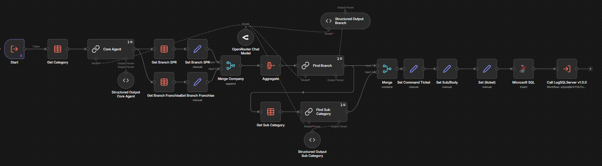
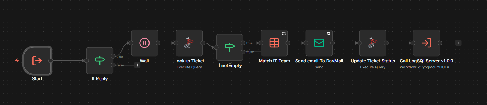
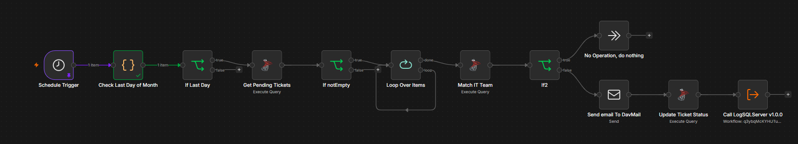
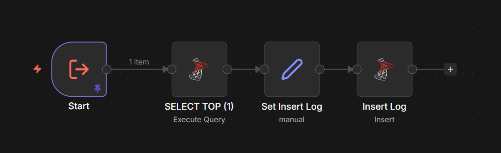

# 📸 Screenshots

n8n workflow screenshots and architecture diagrams for the Auto Ticket System.

> **Last Updated**: 2026-02-16
> **System Version**: v1.7.3

## Available Screenshots

### Workflow Diagrams

| Screenshot | Workflow | Version | Description |
|------------|----------|---------|-------------|
|  | Auto Ticket 1.7 | 1.7 | Main workflow - LINE webhook processing |
|  | Auto Ticket CoreAI 1.3 | 1.3 | AI classification sub-workflow |
|  | Auto Assign 1.2 | 1.2 | IT staff reply assignment sub-workflow |
|  | Schedule Ticket Unclose 1.2 | 1.2 | Scheduled unclosed ticket processing |
|  | LogSQLServer v1.0.1 | 1.0.1 | Centralized audit logging workflow |

### Architecture Diagram

| Screenshot | Source | Description |
|------------|--------|-------------|
|  | [screenshots/architecture.mermaid](screenshots/architecture.mermaid) | Complete system architecture with all workflows and integrations |

## Workflow File References

| Screenshot | Workflow File | Version | Status |
|------------|---------------|---------|--------|
| `main-workflow.png` | [workflows/Auto Ticket.json](./workflows/Auto%20Ticket.json) | 1.7 | ✅ Active |
| `ai-classification.png` | [workflows/Auto Ticket CoreAI.json](./workflows/Auto%20Ticket%20CoreAI.json) | 1.3 | ✅ Active |
| `auto-assign.png` | [workflows/Auto Assign.json](./workflows/Auto%20Assign.json) | 1.2 | ✅ Active |
| `schedule.png` | [workflows/Schedule Ticket Unclose.json](./workflows/Schedule%20Ticket%20Unclose.json) | 1.2 | ✅ Active |
| `log-sql-server.png` | [workflows/LogSQLServer.json](./workflows/LogSQLServer.json) | 1.0.1 | ✅ Active |

## How to Export Screenshots from n8n

### Method 1: Browser Screenshot
1. Open the workflow in n8n editor
2. Zoom out to see the full workflow (Ctrl + Scroll or Ctrl + -)
3. Use browser screenshot tool:
   - **Chrome**: Right-click → Inspect → Ctrl+Shift+P → "Capture full size screenshot"
   - **Firefox**: Right-click → Take Screenshot
4. Save as PNG with descriptive filename

### Method 2: Using Mermaid (for architecture)
1. Edit [screenshots/architecture.mermaid](screenshots/architecture.mermaid)
2. Go to https://mermaid.live
3. Paste the Mermaid code
4. Click "Download PNG"

## Architecture Diagram Details

The [architecture.png](screenshots/architecture.png) shows:

- **LINE Messaging API** - Webhook source
- **Auto Ticket 1.7** - Main workflow handling all events
- **Auto Ticket CoreAI 1.3** - AI classification with OpenRouter
- **Auto Assign 1.2** - IT staff reply assignment
- **Auto Close Ticket 1.0** - Ticket closure with resolution details
- **Schedule Ticket Unclose 1.2** - Daily unclosed ticket processing (18:00)
- **LogSQLServer v1.0.1** - Centralized audit logging
- **Microsoft SQL Server** - Ticket and Log storage
- **External Services** - FTP, DavMail SMTP, OpenRouter LLM

### Color Legend
- 🔵 **Blue** - Main workflow nodes
- 🟣 **Purple** - Sub-workflow nodes
- 🟠 **Orange** - Database nodes
- 🟢 **Green** - External services
- 🩷 **Pink** - LINE API nodes

## Current Workflows

For detailed workflow documentation, see [AGENTS.md](./AGENTS.md)

## Changelog

### 2026-02-16
- ✅ Moved from screenshots/README.md to root SCREENSHOTS.md
- ✅ Updated system version to v1.7.3
- ✅ Updated all image paths for new location

### 2026-02-09
- ✅ Created architecture.mermaid with black text color
- ✅ Rendered architecture.png from Mermaid source
- ✅ Updated all workflow versions to current state
