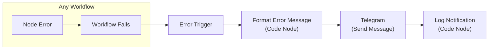

# Error Notify Telegram

> **Version:** 1.0.0  
> **Type:** Global Error Handler  
> **Status:** Development  

---

## Overview

Centralized error notification workflow that catches failures from **any** workflow and sends detailed error logs to Telegram. Uses n8n's built-in **Error Trigger** mechanism — one workflow monitors all others.

## Architecture



## How It Works

### n8n Error Workflow Mechanism

n8n supports a **global error workflow** via `settings.errorWorkflow`. When configured:

1. Any workflow that encounters an unhandled error triggers this workflow
2. The **Error Trigger** node receives full error context including:
   - Which workflow failed (name, ID)
   - Execution details (ID, URL, timestamp)
   - Which node caused the error (name, type)
   - Error message and stack trace
   - Full execution data (all node inputs/outputs)

### Workflow Nodes

| Node | Purpose |
|------|---------|
| **Error Trigger** | n8n built-in trigger — fires when any linked workflow errors |
| **Format Error Message** (Code) | Parses error data, builds formatted HTML message |
| **Telegram** | Sends the formatted alert to your Telegram chat/channel (chatId configured here) |
| **Log Notification** (Code) | Optional audit log of sent notifications |

### Telegram Message Format

```
🔴 Workflow Error Alert

📋 Workflow: Auto Ticket 1.7.2
🆔 Workflow ID: xxxxx
⏰ Time: 21/5/2567 14:30:00

⚠️ Error Node: Microsoft SQL
❌ Error Message:
   Connection timeout after 30000ms

🔗 Execution: xxxxx
📊 Nodes in execution: 23

📝 Full Execution Data:
   {... truncated execution data ...}
```

---

## Setup Instructions

### Step 1: Create Telegram Bot

1. Open Telegram, search for `@BotFather`
2. Send `/newbot` and follow prompts to create a bot
3. Copy the **Bot Token** (looks like `123456:ABC-DEF...`)
4. Send a message to your new bot
5. Visit `https://api.telegram.org/bot<TOKEN>/getUpdates` to find your **Chat ID**

### Step 2: Configure n8n Credentials

1. In n8n, go to **Credentials** → **Add Credential**
2. Search for **Telegram**
3. Enter the Bot Token from Step 1
4. Save as `Telegram Bot API`

### Step 3: Import & Configure Workflow

1. Import `workflows/Error Notify Telegram.json` into n8n
2. Open the **Telegram** node
3. Replace `YOUR_TELEGRAM_CHAT_ID` with your actual Chat ID
4. Select your Telegram Bot API credential
5. **Activate** the workflow

### Step 4: Link Error Workflow to All Workflows

For **each** existing workflow, configure the error workflow setting:

1. Open any workflow (e.g., "Auto Ticket 1.7.2")
2. Go to **Settings** (gear icon)
3. In the **Error Workflow** dropdown, select **"Error Notify Telegram"**
4. Save the workflow

Repeat for all workflows:
- Auto Assign 1.2.1
- Auto Close Ticket 1.2.1
- Auto Ticket CoreAI 1.3.2
- Auto Ticket 1.7.2
- LogSQLServer 1.0.1
- Schedule Auto Open Ticket Unclose 1.0
- Schedule Ticket Unclose 1.4.1

> **Alternative:** Use n8n's **Global Error Workflow** feature (Settings → Error Workflow) if available in your n8n version — this links ALL workflows automatically without per-workflow configuration.

---

## Configuration Reference

### Environment Variables (Optional)

| Variable | Description | Default |
|----------|-------------|---------|
| `TELEGRAM_CHAT_ID` | Target chat/channel for alerts | Set in workflow node |
| `ERROR_NOTIFY_ENABLED` | Disable notifications (set `false`) | `true` |

### Customization

#### Change Message Format

Edit the `Format Error Message` Code node. The message is built as a template string with HTML formatting. Key variables:

| Variable | Source | Example |
|----------|--------|---------|
| `workflowName` | `errorData.workflow.name` | `Auto Ticket 1.7.2` |
| `errorNode` | `errorData.executionError.node.name` | `Microsoft SQL` |
| `errorMessage` | `errorData.executionError.message` | `Connection timeout...` |
| `executionId` | `errorData.execution.id` | `abc123-def456` |
| `executionData` | `errorData.executionData` | Full node data JSON |

#### Add More Notification Channels

Duplicate the **Telegram** node and add:
- **Slack** node (for team channels)
- **Email** node (for escalation)
- **Discord** node (for team alerts)

Connect them in parallel after `Format Error Message`.

---

## Error Data Structure

The Error Trigger provides this data structure:

```json
{
  "execution": {
    "id": "execution-uuid",
    "url": "https://your-n8n.com/execution/123",
    "startedAt": "2026-05-21T07:30:00.000Z",
    "finishedAt": "2026-05-21T07:30:05.000Z"
  },
  "executionError": {
    "message": "Connection timeout after 30000ms",
    "node": {
      "name": "Microsoft SQL",
      "type": "n8n-nodes-base.microsoftSql",
      "parameters": { ... }
    }
  },
  "workflow": {
    "id": "workflow-uuid",
    "name": "Auto Ticket 1.7.2"
  },
  "executionData": {
    "startNode": { ... },
    "failedNode": { ... }
  }
}
```

---

## Testing

### Manual Test

1. Create a test workflow with a failing node (e.g., HTTP Request to invalid URL)
2. Set its Error Workflow to "Error Notify Telegram"
3. Execute the test workflow
4. Verify the Telegram message arrives

### Expected Behavior

- ✅ Telegram message with workflow name, error node, error message
- ✅ Execution ID for debugging in n8n UI
- ✅ Timestamp in Bangkok timezone
- ✅ Truncated long messages (Telegram 4096 char limit)
- ✅ Works with all 7 existing workflows

---

## Troubleshooting

| Issue | Solution |
|-------|----------|
| No Telegram messages received | Check Bot Token and Chat ID are correct |
| Message too long / not sent | Error messages are truncated to fit Telegram limits |
| Error workflow not triggering | Verify Error Workflow is set in the failing workflow's Settings |
| Bot cannot see messages | Send `/start` to the bot first; check Chat ID from getUpdates |
| Missing execution data | Some n8n versions limit execution data in error payloads |

---

## Related

- [Auto Ticket](auto-ticket.md) — Main workflow (most complex, most error-prone)
- [Auto Ticket CoreAI](auto-ticket-coreai.md) — AI classification (LLM failures)
- [Audit Logging](audit-logging.md) — Existing log infrastructure via LogSQLServer
- [External Services](../integrations/external-services.md) — Service integration reference
